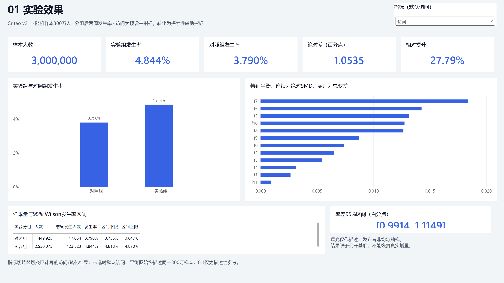

# 广告投放增量效果评估与目标人群优化

**Python · LightGBM · DuckDB SQL · Power BI · 因果增量评估**

以Criteo官方v2.1公开实验为基础，研究广告分组的访问/转化增量，以及预算有限时的目标人群策略。访问为预设主指标，转化为探索性辅助指标。交付完整代码、真实离线结果、两份Notebook、九阶段学习讲解及三页Power BI项目。

**当前状态：项目完成，分析结果公开。** 仓库：[lguo716/criteo-uplift-analysis](https://github.com/lguo716/criteo-uplift-analysis)。300万样本全流程已实际运行，18项测试、46项产物检查、7项SQL核对及33项Power BI DAX核对通过；PBIX已在Desktop保存、重新打开、刷新并检查切片器。详细证据见[验收记录](reports/project_acceptance.md)。

## 1. 业务问题与主要结果

- 公开样本中随机允许广告投放是否增加访问与转化？
- 增量模型能否识别更值得触达的人群？
- 20%预算下，它是否优于随机策略与普通响应概率排序？

| 实际结果 | 数值 |
|---|---:|
| 全量扫描记录 | 13,979,592 |
| 均匀随机样本 | 3,000,000 |
| 训练 / 验证 / 测试 | 1,800,000 / 600,000 / 600,000 |
| 访问组间绝对差 | 1.0535个百分点 |
| 访问率差95%区间 | [0.9914, 1.1149]个百分点 |
| 访问相对提升及95%区间 | 27.79%，[25.80%, 29.81%] |
| 转化组间绝对差（探索性） | 0.1114个百分点 |
| 验证集选定访问增量模型 | S-Learner |
| 20%预算：随机增量访问 / 每万候选人 | 21.07 |
| 20%预算：S-Learner增量访问 / 每万候选人 | 89.59 |
| 20%预算：响应排序增量访问 / 每万候选人 | 97.28 |

S-Learner相对随机多68.52次/每万人，配对95%条件区间[59.92,77.12]。**普通响应基准更高**：S相对响应少7.69次，区间[-13.22,-1.50]。保留该比较结果，不声称增量模型必然优于简单基准。


## 2. 数据来源与范围

来源：[Criteo官方组织镜像](https://huggingface.co/datasets/criteo/criteo-uplift)；设计参考[数据论文](https://arxiv.org/pdf/2111.10106)。下载v2.1压缩CSV约311MB，验证发布者文件SHA256，再从全文件均匀不放回抽取300万条，固定种子42。数据许可与论文引用见[NOTICE](NOTICE.md)。

数据经过发布者非均匀抽样，本项目不能恢复原活动真实增量。每行是匿名用户实验记录，标签观察期为分组后两周；无日期、广告主编号、真实成本和收入。

## 3. 数据粒度与质量

12个处理前匿名特征，随机处理`treatment`，访问`visit`，转化`conversion`，实际曝光`exposure`。源行号仅用于定位和抽样复核；相同匿名记录保留并计数，不能据此确认重复用户。

全量检查缺失、有限值、二元标签、控制组曝光、无访问转化、源行数。连续特征做SMD，类别做总变差距离；0.1仅作描述性参考。约85%/15%的公开组比例不能替代原始分流方案，故不宣称正式SRM通过。

## 4. 指标、模型与验证

发生率=结果人数/组人数，绝对差为两组发生率之差，相对提升为差/对照率。采用Wilson单组区间、Newcombe率差区间与log风险比变换的相对提升区间。完整实验区间见[experiment_effect_intervals.csv](reports/tables/experiment_effect_intervals.csv)。

使用LightGBM实现访问S/T/X-Learner，转化S/T-Learner，以及普通响应概率基准。按处理和结果联合标签固定60%/20%/20%划分；编码仅在训练集拟合，验证集负责早停及Qini选择，测试集做最终比较。实际曝光、结果标签、位置和split均不作模型特征。

统一采用处理比例校正累计增量，给出Qini、AUUC、Top-K、十分位与预算曲线。500次配对分层Bootstrap共享模型抽样权重。完整定义见[指标口径](docs/metric_definitions.md)。

## 5. 业务建议与局限

定向排序在预设20%情景中优于随机，但响应排序基准高于本次选定增量模型。建议把两者作为下一轮真实实验候选，继续观察转化与实际成本。

预算为归一化离线情景，没有真实ROI、企业收入提升或成本节约。匿名特征不编造人口属性。区间以已训练模型和固定Top-K成员为条件，不包含重新训练、全部模型选择与上线漂移的不确定性；缺少身份和活动标识，无法做跨活动聚类验证。

## 6. 程序与复现

先克隆仓库，再在项目根目录打开PowerShell，使用Python 3.12：

```powershell
git clone https://github.com/lguo716/criteo-uplift-analysis.git
cd criteo-uplift-analysis
python -m venv .venv
.\.venv\Scripts\python.exe -m pip install -r requirements.txt
.\.venv\Scripts\python.exe -m src.run_pipeline --stage all --sample-size 3000000 --seed 42
.\.venv\Scripts\python.exe -m pytest -q
.\.venv\Scripts\python.exe -m src.execute_notebooks
```

首次需联网下载数据。后续复现会校验缓存；同样本配置使用已保存抽样。核心阶段可分别运行`download/prepare/experiment/train/evaluate/report/verify`，例如：

```powershell
.\.venv\Scripts\python.exe -m src.run_pipeline --stage evaluate --bootstrap 500
.\.venv\Scripts\python.exe -m src.learn --stage 7
```

源数据约311MB，项目含虚拟环境和行级产物约数GB；本轮在32GB内存环境实际完成。配置、日志与阶段时长分别在run_config.json、logs/及reports/stage_timings.json。依赖精确版本已锁定requirements.txt。

## 7. Power BI

打开[完整PBIX](powerbi/criteo_uplift_analysis.pbix)或[可编辑PBIP项目](powerbi/Criteo.pbip)，三页为实验效果、模型与人群、预算策略。模型通过Power Query读取reports/tables汇总CSV，ProjectRoot参数控制根目录。移动项目后修改该参数并刷新。操作、度量和表关系见[Power BI说明](powerbi/README.md)。



[模型与人群高清截图](reports/figures/powerbi/report_models.png) · [预算策略高清截图](reports/figures/powerbi/report_budget.png)

重新生成自动报告：

```powershell
.\.venv\Scripts\python.exe powerbi\build_dashboard.py
```

构建会重写自动生成源文件；保留手工版本后再构建。新项目独立包含Microsoft基础主题。报告工具版本见powerbi/package.json；需要验证/截图工具时，Node.js 20+执行`npm --prefix powerbi install`。

指标切片器未选时默认访问；预算切片器默认20%，仅影响预算卡片和表格，曲线显示所有预算。静态说明明确标注20%访问情景。Python预计算模型与置信区间，Power BI不动态重训。

PBIX由Power BI Desktop实际另存生成，并在新进程重新打开、执行主页刷新，核对访问/转化及0%/20%/50%/100%预算交互。三张高清截图来自实际运行报告。本地结构校验0错误、0告警；在线校验0错误，官方Schema获取存在告警（其中Desktop写入的2.13.0地址返回404），详见验收记录。

## 8. 学习与复现入口

- [业务报告](reports/findings.md)
- [完整流程讲解](docs/project_complete_walkthrough.md)
- 九阶段学习：`python -m src.learn --stage 1`至`--stage 9`
- [实验Notebook](notebooks/01_experiment_analysis.ipynb)、[模型与策略Notebook](notebooks/02_uplift_and_strategy.ipynb)
- [复现与验收指南](docs/learning_stage_09_reproducibility.md)
- [SQL核对](reports/sql_verification.json)、[产物一致性](reports/artifact_verification.json)
- [交付文件与SHA256核对](reports/delivery_verification.json)

## 9. 目录

`src/`核心程序；`sql/`独立取数核对；`data/`数据与身份清单；`models/`模型和选择记录；`reports/tables/`真实结果；`reports/figures/`分析图与Desktop截图；`notebooks/`两个已执行学习入口；`docs/`口径与九阶段讲解；`powerbi/`PBIP模型、报告、主题和验证脚本；`tests/`已知效果与边界检查。

公开仓库包含代码、锁定依赖、数据身份清单、模型选择与训练配置、已执行Notebook、真实汇总结果、中文学习材料、PBIP/PBIX和最终高清截图。原始数据、抽样Parquet、逐行预测、训练模型二进制、类别字典、虚拟环境和本机缓存不上传；运行全流程可重新生成。

仅查看已有成果无需下载原始数据：阅读业务报告或直接打开PBIX。克隆后刷新Power BI时，将ProjectRoot参数改为克隆目录，现有reports/tables中的汇总CSV已齐备。源数据与相关衍生成果许可见[NOTICE](NOTICE.md)，自写代码采用[MIT](LICENSE)。
