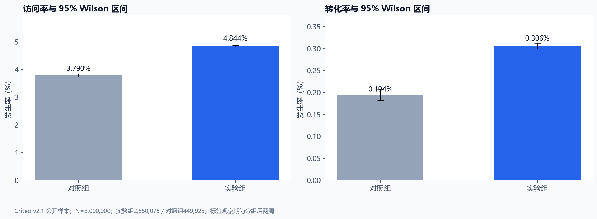
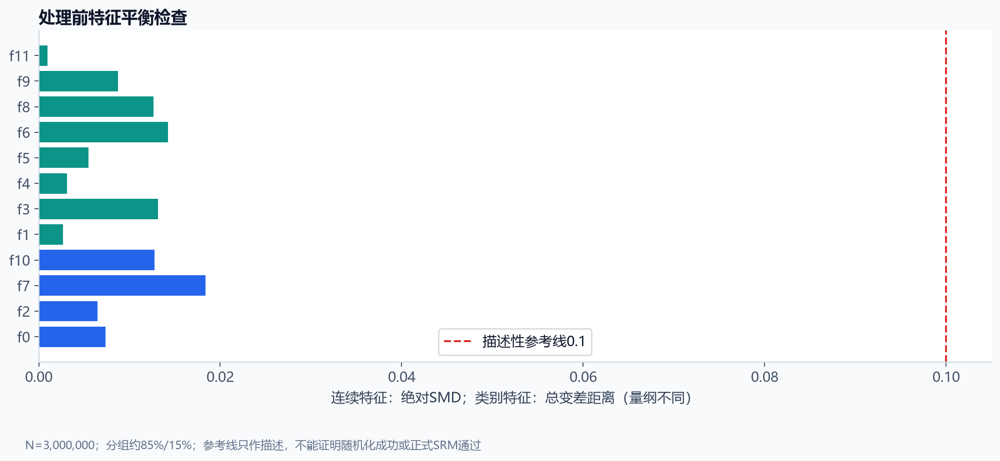
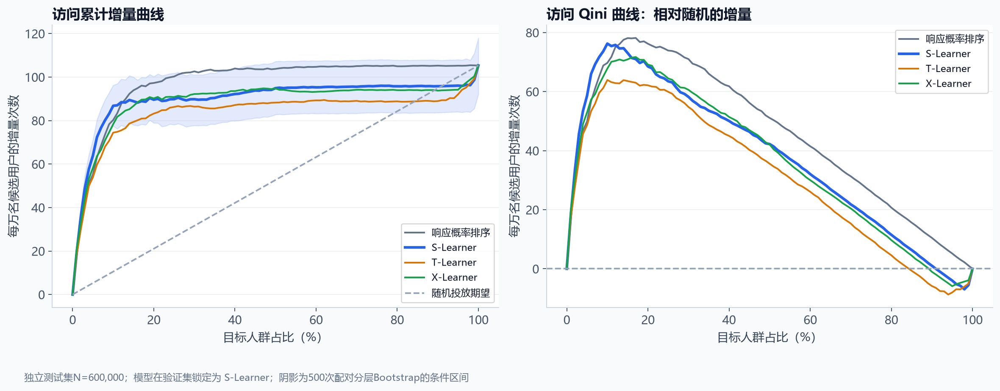
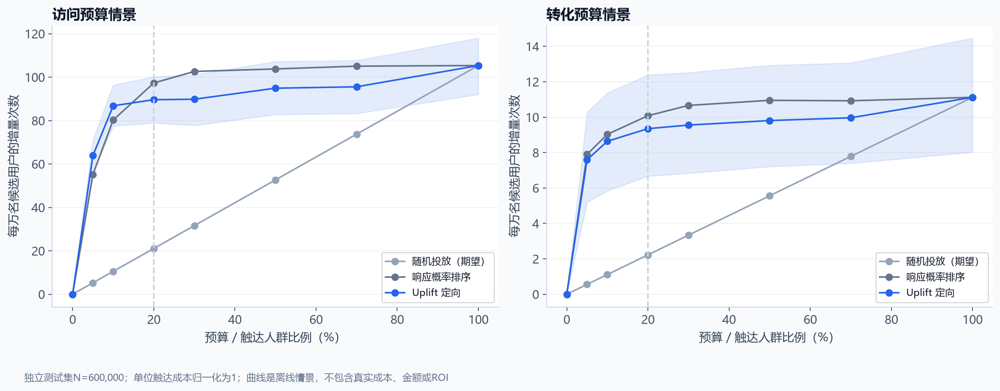

# 广告投放增量评估与精准营销：业务分析报告

## 数据与决策问题

使用Criteo v2.1公开基准，扫描完整13,979,592条记录后均匀随机抽取3,000,000条，种子42。每行代表一个匿名用户在一次实验中的记录；标签表示分组后两周内是否访问、转化。实验组2,550,075人，对照组449,925人。数据没有真实成本、收入、时间戳、广告主编号或可解释的人口属性。

回答三个问题：公开样本中是否存在增量差异；模型能否把增量较高的人群排在前面；固定预算下定向策略是否优于随机选择。访问为预设主指标，转化为探索性辅助指标。

## 实验结果

| 指标 | 实验组 | 对照组 | 绝对差（百分点） | 95%区间（百分点） | 相对提升 | 相对提升95%区间 |
|---|---:|---:|---:|---:|---:|---:|
| 访问 | 4.844% | 3.790% | 1.0535 | [0.9914, 1.1149] | 27.79% | [25.80%, 29.81%] |
| 转化 | 0.306% | 0.194% | 0.1114 | [0.0965, 0.1256] | 57.36% | [46.74%, 68.74%] |

两项公开样本组间差异的区间均高于0。访问是主要推断；转化结果属于辅助探索，不据此把真实平台收益外推为确定值。组率用Wilson区间，率差用Newcombe区间，不能把各组区间简单相减。

相对提升使用log风险比正态近似区间再减1。四类估计与区间统一导出至[experiment_effect_intervals.csv](tables/experiment_effect_intervals.csv)；计算方法及来源见[统计口径](../docs/metric_definitions.md)。

## 数据质量与平衡

完整原始文件通过缺失、有限值、二元标签、控制组不得曝光、无访问不得转化及行数检查。连续变量使用绝对SMD，匿名类别使用总变差距离；12个特征的描述性差异均小于0.1。类别参考线为项目描述性约定，量纲不同于SMD。公开约85%/15%比例不等于原始实验的预设分流方案，不能宣称正式SRM检验通过。

## 模型与独立评估

训练/验证/测试=1,800,000/600,000/600,000，按处理组、访问和转化的联合标签分层。类别字典只在训练集拟合，未见类别按缺失处理；曝光、结果标签及行号均不是模型输入。

访问比较S/T/X-Learner，转化比较S/T-Learner。普通响应概率模型只作为排序对照。LightGBM使用预先固定参数和验证集早停；主模型按验证集Qini选择，访问锁定为**S-Learner**，转化锁定为**T-Learner**。不根据测试结果更换主模型。

完整模型数值见 [model_evaluation.csv](tables/model_evaluation.csv)，所有模型均保留验证集和测试集结果。

## 20%预算情景与业务建议

| 策略 | 每万名候选用户的增量访问 | 95%条件区间 | 归一化触达成本 |
|---|---:|---:|---:|
| 随机选择20% | 21.07 | [18.41, 23.60] | 2,000 |
| 响应概率选择20% | 97.28 | [84.58, 109.83] | 2,000 |
| Uplift选择20% | 89.59 | [78.90, 100.21] | 2,000 |

定向相对随机的增量差为每万人68.52次，配对95%条件区间[59.92, 77.12]。在20%预算情景中，相对随机投放的条件区间下限大于0，支持继续开展独立线上验证。选择20%预算来自预设展示情景，不是从测试集挑选出的最优预算。

**普通响应概率排序优于本次选定的访问Uplift模型。** 同预算下，S-Learner相对响应排序的差为每万人-7.69次，配对95%条件区间[-13.22, -1.50]。这说明不能因为使用了因果模型就认定策略更好，也不依据测试结果重新选择Uplift主模型。

建议将响应排序与访问增量排序共同作为下一轮独立实验候选，并同时观察转化。本轮没有证明S-Learner优于响应基准。匿名特征无法转化为“高收入”“年轻用户”等命名人群；十分位组只表示评分层级。未掌握实际触达成本和收入时，不把归一化效率称为真实ROI。

## 局限与下一步

发布者非均匀抽样改变了原始活动的增量规模；本报告只能讨论公开基准样本。无法观察同一个人的两个潜在结果，预测评分也无法证明某个用户一定被广告说服。没有用户或广告主标识，无法做跨活动验证、聚类置信区间或核查同一人在多个实验中的关联性。

500次Bootstrap在处理组内抽样，模型间共享抽样权重。区间以已训练模型和固定Top-K成员为条件，未包含重新训练、模型选择和上线环境漂移的全部不确定性。未来真实实施需要新实验、预设主要指标、实际成本记录和独立策略验证。

## 复现与证据

- [指标与评估口径](../docs/metric_definitions.md)
- [完整学习复盘](../docs/project_complete_walkthrough.md)
- [模型选择记录](../models/model_selection.json)
- [评估协议](evaluation_protocol.json)
- [SQL核对](sql_verification.json)
- [验收记录](project_acceptance.md)
